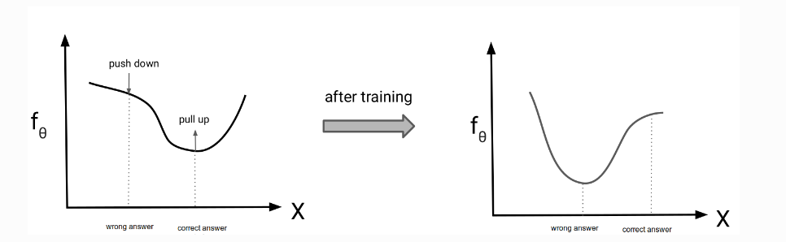
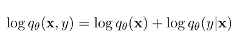
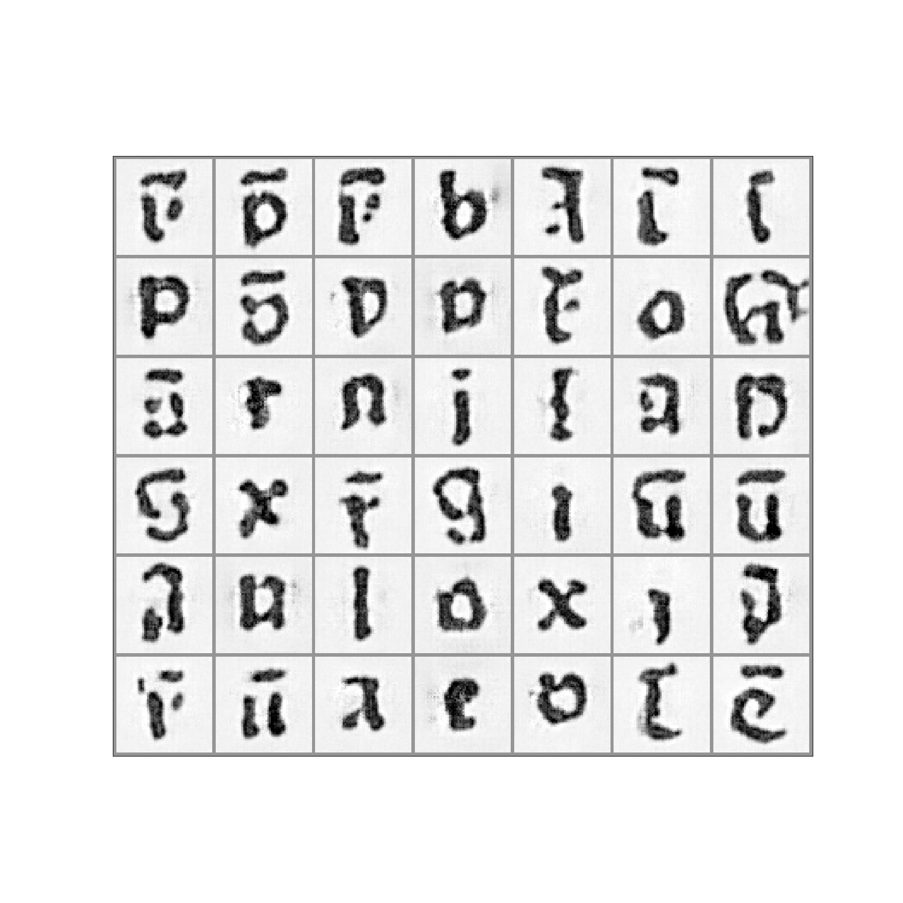
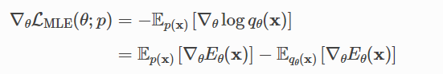
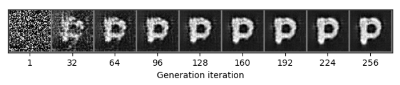
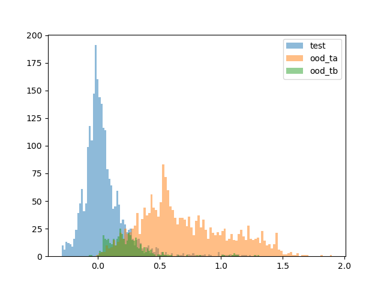

# EBM and JEM

## EBM (Energy-Based Model)
Basic Assumption: Higher the energy, lower the probability.


## JEM (Joint Energy-Based Model)


Generated samples are used to estimate the partition function.

Final Example: 


## Training Strategies for Stability
### Contrastive Divergence Loss


### Reservoir Sampling - SGLD : 
```MCMCSampler.synthesize_samples()```: 
    perform SGLD sampling for a given number of steps, and return the final samples. Set up different replay buffers for conditional and unconditional sampling.

The sampling process is shown below: _class label=7_

## Out-of-Distribution (OOD) Detection
```run_ood_detection()```: 
    OOD detection on **GLYPHS** dataset. We use two extra datasets to test the performance.

```score_fn()```: 
    score function for OOD detection. Use the negative log-likelihood ```p(x)``` as the score function.

The histogram of the score function is shown below: 


JEM can be used as a binary classifier: 

```0```: in-distribution (**ID**): all blue bars

```1```: out-of-distribution (**OOD**): all orange bars

after setting the threshold (**0.25**), we can use it to detect OOD.

Corresponding ROC score : **0.9153815771938624**

